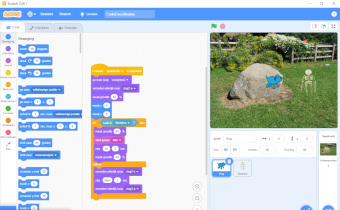
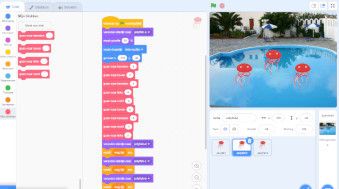
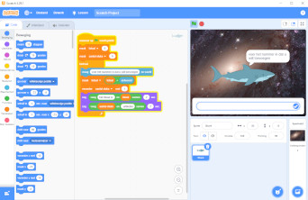
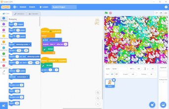

# :mortar_board: Scratch Projecten

:heavy_check_mark: Completed  
:o: Incomplete

## :beginner: Coder Academy

- Getting to Know Code
  1. :heavy_check_mark: What is Coding?
  2. :heavy_check_mark: Think Like a Coder
  3. :heavy_check_mark: Binary Basics
  4. :heavy_check_mark: Computer Languages
  5. :heavy_check_mark: Start From Scratch
  6. :heavy_check_mark: Plot Coordinates
  7. :heavy_check_mark: :video_game: Code Coordinates
  8. :heavy_check_mark: Step By Step
  9. :heavy_check_mark: :video_game: Make a Sprite Dance
  10. :heavy_check_mark: Variables
  11. :o: Flow Charts
  12. :o: Making Decisions
  13. :o: Using Broadcasts
- Art and Animation
- Music
- Website
- Coders's Kit

### Coder Academy Projecten

- Code Coordinates -- `CodeCoordinates.sb3`  
  
- Make a Sprite Dance -- `SpriteDance.sb3`  
  
- Variabelen -- `Variabelen.sb3`  
  

## :beginner: Programmeren voor kinderen

:link: [Programmeren voor kinderen - Projects](https://www.lannoo.be/nl/programmeren-voor-kinderen-projects-0)

1. :construction: TODO

### Programmeren voor kinderen Projecten

- Kattenkunst -- `Kattenkunst.sb3`  
  

## :video_game: Spelletjes en ander projecten

- :file_folder: [Projecten](projecten/)

## :page_with_curl: License

The source code is free -- see the [LICENSE](LICENSE) file for details
